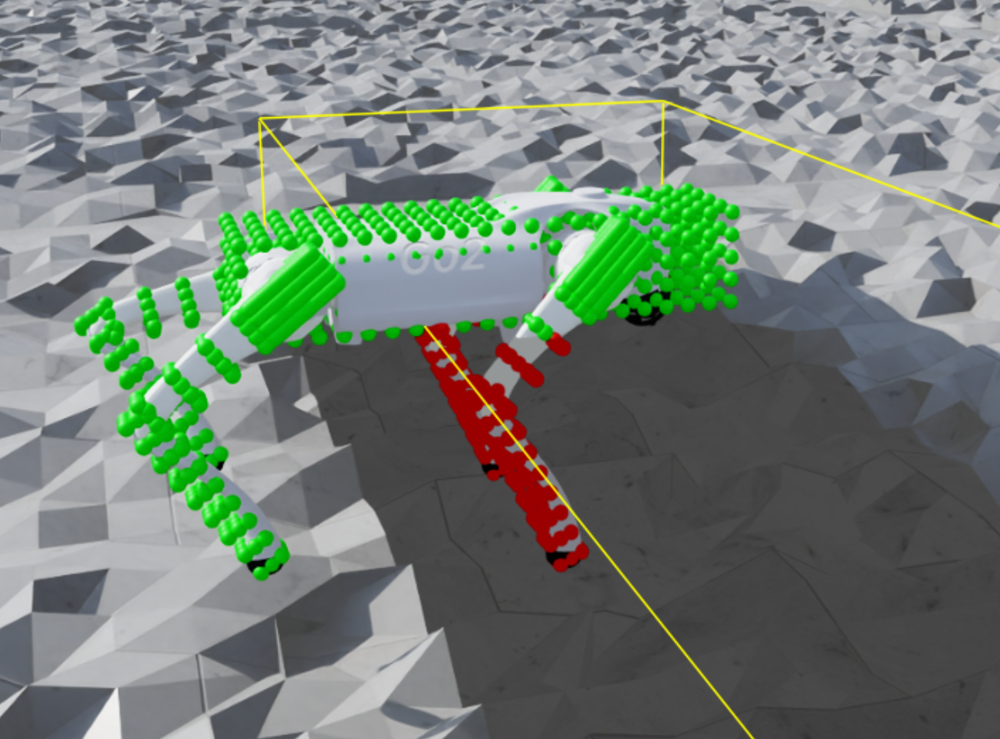

# Robot Parkour Learning with Unitree Go2

**Agile Locomotion in NVIDIA Isaac Lab using Soft-to-Hard Curriculum Learning**

  


<p align="center">
  
  
</p>
<p align="center">
  
  
</p>


<p align="center">
  
</p>


## Overview

This repository implements an agile locomotion framework for the **Unitree Go2** quadruped in **NVIDIA Isaac Lab**. Inspired by [Robot Parkour Learning](https://arxiv.org/abs/2309.05665) (Zhuang et al.), it uses a **"Soft-to-Hard"** physical curriculum to train robust policies for traversing discrete obstacles like boxes and narrow passages.
Here is the authors' implementation in [Isaac Gym](https://github.com/ZiwenZhuang/parkour/tree/main).

The training trats obstacles as penetrable "ghosts" first, and then make them solid objects to enable complex climbing and balancing behaviors.

## Key Features

* **Soft-to-Hard** Curriculum: Dynamic terrain generation where obstacle stiffness and penetration penalties evolve during training.
* Perception Pipeline:
    * Depth Scanning: Custom `RayCaster` implementation for forward-facing depth images (ignoring other agents).
    * Latent Convolutional Autoencoder to compress depth inputs for the student policy.
* **Distillation:** Pipeline to distill privileged teacher policies into sensor-based student agents.

## Installation

1.  Install Isaac Lab: Follow the [official guide](https://isaac-sim.github.io/IsaacLab/).
2.  Clone & Install:
    ```bash
    git clone https://github.com/LucaFrat/Parkour_Learning.git
    pip install -e source/Robot_Parkour
    ```

## Usage

### 1. Train Teacher Policy (Soft-to-Hard)
Train the agent on specific parkour tasks:
```bash
# Climbing over box with soft dynamics
python scripts/rsl_rl/train.py --task Isaac-Go2-Climb-Soft-v0 --headless

# Climbing over box with HARD dynamics (specify the info of the policy to load in the rsl_rl_ppo_cfg.py file)
python scripts/rsl_rl/train.py --task Isaac-Go2-Climb-Hard-v0 --resume --headless

# Play a policy on the climb task
python scripts/rsl_rl/play.py --task Isaac-Go2-Tilt-Hard-Play-v0 --checkpoint logs/rsl_rl/parkour_gru/2026-01-29_05-45-53/model_2550.pt

# Narrow passage with soft dynamics
python scripts/rsl_rl/train.py --task Isaac-Go2-Tilt-Soft-v0 --headless
```

### 2. Play Teacher Policy
```bash
# Play a policy on the climb task
python scripts/rsl_rl/play.py --task Isaac-Go2-Tilt-Hard-Play-v0 --checkpoint logs/rsl_rl/parkour_gru/2026-01-29_05-45-53/model_2550.pt
```

### 3. Train Student Policy
