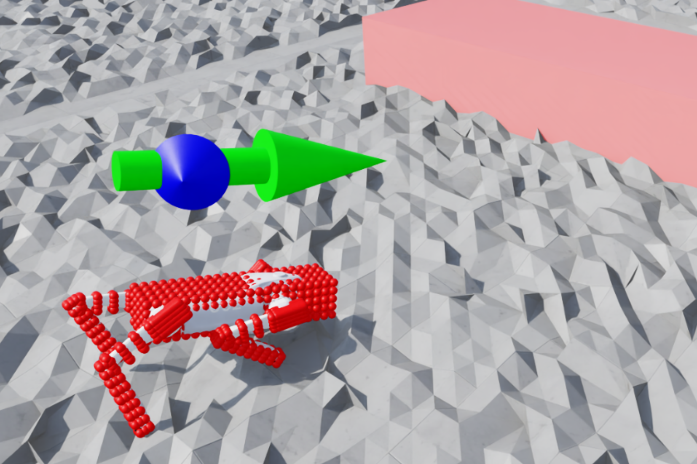

# Robot Parkour Learning (Isaac Lab)

  

This repository serves as an **unofficial** reproduction and modernization of the paper [Robot Parkour Learning](https://arxiv.org/abs/2309.05665) (Zhuang et al., 2023) using NVIDIA Isaac Lab. Here is the authors' implementation in [Isaac Gym](https://github.com/ZiwenZhuang/parkour/tree/main).

The goal is to port the original monolithic Isaac Gym implementation into the modular, manager-based architecture of Isaac Lab, enabling easier extension and sim-to-real transfer for agile legged locomotion.